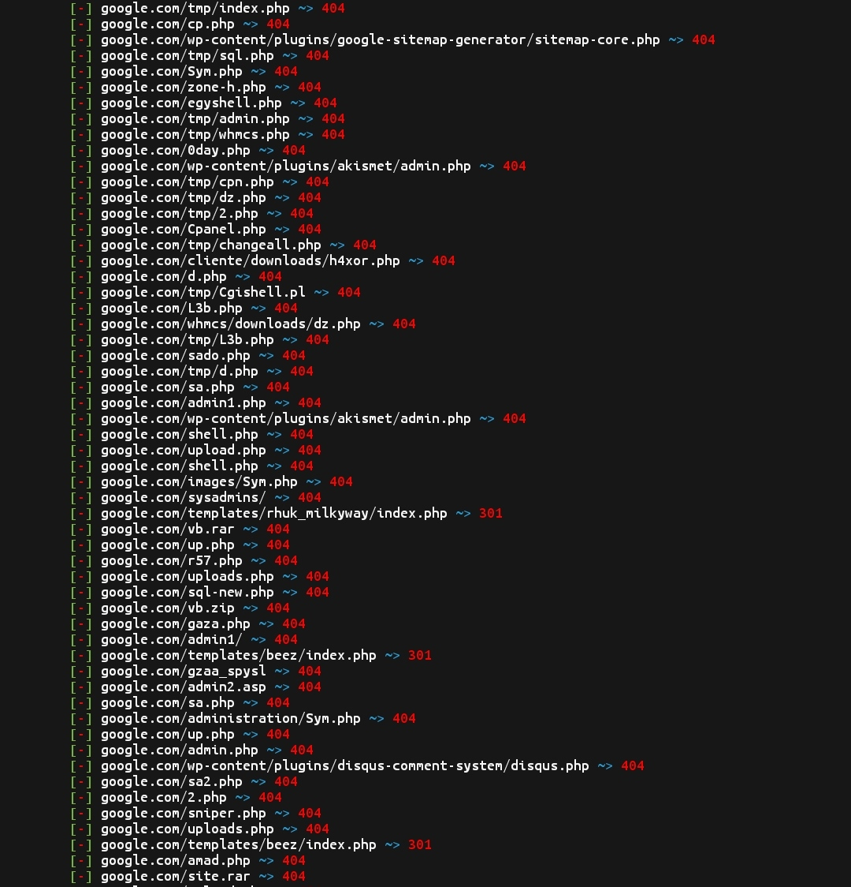

#### Features
- [x] Multi-threading sob demanda
- [x] Grande lista de palavras (31371 patch)
- [x] Suporta extensões php, asp e html
- [x] Verifica possíveis vulnerabilidades de EAR
- [x] Suporte para padrões personalizados
- [x] Rastreamento da Web
- [ ] Verifica robots.txt

---
## Instalando no Termux

* `pkg upgrade`
* `pkg update`
* `pkg install git`
* `git clone https://github.com/mishakorzik/AdminHack`
* `cd AdminHack`
* `bash setup.sh`

#### Tudo está pronto! Agora estamos esperando tudo para baixar!
 * `succes`

---
## Instalando para linux

* `apt update`
* `apt upgrade`
* `apt install git`
* `git clone https://github.com/White1Hats/AdminHack`
* `cd AdminHack`
* `bash setup.sh`

---
## Iniciar programa
#### Insira um comando para iniciar o AdminHack.

* `bash AdminHack.sh`

#### Se houver problemas, olhe para baixo, haverá falha no download.
---

## Screenshot

#### aqui você pode ver uma captura de tela do AdminHack
 

 

###### By white_hats: Report bug: Nuke System
